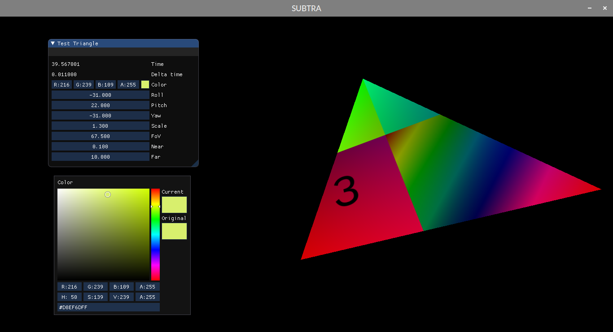

# SUBTRA — a realtime 3D engine
\[insert logo here\]

**SUBTRA** is a realtime 3D rendering engine project, which focuses on generating high quality graphics in real time on modern hardware. My main purpose with this project is to have a framework for creating demos, as well as games with high fidelity graphics. In the future it will be a safe space for 3D graphics experiments, but now it's making baby steps into the third dimension.

## Primary goals
- Realtime - except for occasional use of offline techniques, the engine itself should run at realtime framerates on modern hardware,
- High quality - images generated using **SUBTRA** should be comparable to those achieved with modern game engines,
- Configurable - most, if not all, parameters shall be modifiable while running, either for stylistic or for performance purposes,
- Easy to understand - cognitive overload should be minimized, all code should be straightforward and raise as few questions as possible.

## Secondary goals
- Rasterization methods - polygon rendering, implicit surface rendering, and other methods will be available for use,
- Cross-platform - utilized technologies should allow for running accross a multitude of devices,
- Scriptable - different parts of the engine, including sequencing, animation and rendering should be editable through script files

## Personal goals
- Learn and improve my C++, OpenGL and graphics programming abilities,
- Good code architecture - it always felt like a pet peeve of mine, so in this project I will be focusing on having a very nice and easy to traverse class hierarchy,
- Nice and standardized code - because _duh_,
- Create something! - ~~as of writing this (Oct 2019), my hopes are that I will release something using this engine by the end of this year, either a demo or some kind of a game~~ haha _you joker_

## Planned/wanted features
- Full PBR support,
- GI (offline + realtime),
- Soft shadows,
- A plethora of post processing effects,
- Timeline/sequencing + interactive controls,
- Vulkan support

## Languages used
- **C++** (C++17): main codebase,
- **GLSL** (3.3): shaders,
- **Lua**: scripting

## Technologies used
- [**OpenGL 3.3**](https://www.khronos.org/registry/OpenGL/specs/gl/glspec33.core.pdf): rendering,
- [**SDL2**](https://www.libsdl.org/): window, event/input processing,
- [**IMGUI**](https://github.com/ocornut/imgui): graphical interface,
- [**Lua**](https://www.lua.org/): scripting capabilites,
- **GLAD** (using [Dav1dde](https://github.com/Dav1dde)'s [web-based generator](https://glad.dav1d.de/)),
- [**stb_image.h**](https://github.com/nothings/stb): texture loading

## Recommended reading
- [Learn OpenGL](https://learnopengl.com/) - very useful OpenGL tutorials,
- [OpenGL Tutorial](http://www.opengl-tutorial.org/) - also very useful OpenGL tutorials!

## Questions and answers
- **Why OpenGL 3.3? Wasn't it released in 2010?**

  Yes, it was. And my laptop was released in 2012, so it supports OpenGL 3.3. And I like to work in transit. This means we lose some nice core features, such as tessellation (OpenGL 4.0) or debug messaging (4.3), but I *really* like to work in transit. (EDIT: _please somebody buy me a new laptop_ (EDIT EDIT: I spilled water on the keyboard it doesn't work anymore _**please buy me a new laptop**_))
  
- **Why "SUBTRA"?**

  Just came up with this name when I was thinking about the word _subtractive_. It sounds like a secret U.S. government program, like MK-Ultra, and the word itself immediately gave me some ideas for a logo (WIP).
  
  Other early (worse) candidates: **blob**, **HUE**, **PRISM Engine**. I hereby waive all my rights to those names, feel free to use any of these byproducts. Definitely not gonna use the **_HUEHUEHUEHUE_** name.
  
## Contribute
Do you know how to build stuff? Do you know how to test stuff? You're hired! Try building a standalone executable for your platform of choice, prepare instructions on how to build it for that environment, and I'll be more than happy to include it in this repository. To contact me, use info at the bottom of this page.
  
## Licence/License
Depends on the version of English that you use. The word, not the licence itself. I'm not a lawyer, but I know an MIT license is good, [here is a licence file generated by GitHub](LICENSE), and you are free to use this project in any way you can imagine. Learn from it, let me know how to make it better, test it, have fun with it, take it on a date, do whatever. I'll be glad to know what you've done with it though!

## Created by
Matthias Scherba ([Twitter @szczm_](https://twitter.com/szczm_), [e-mail](mailto:matthias.scherba@gmail.com))
